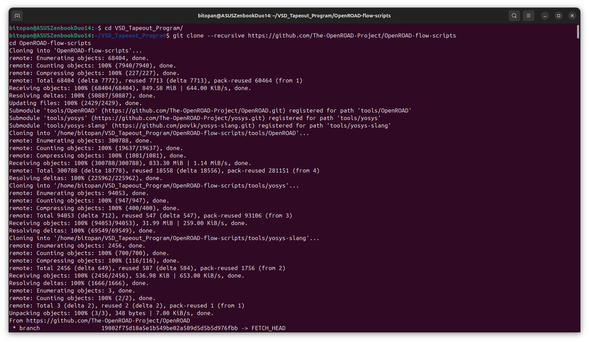
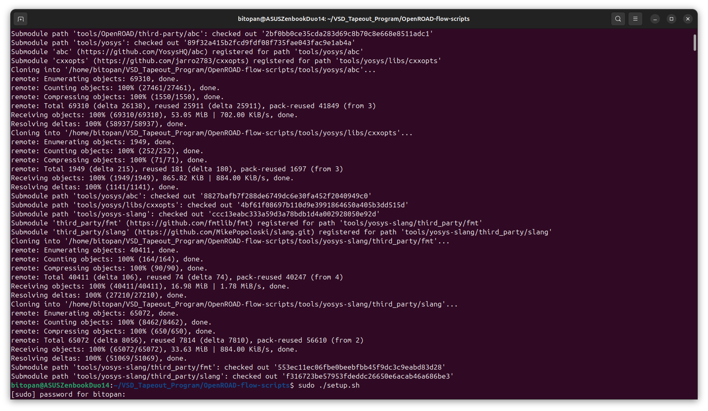
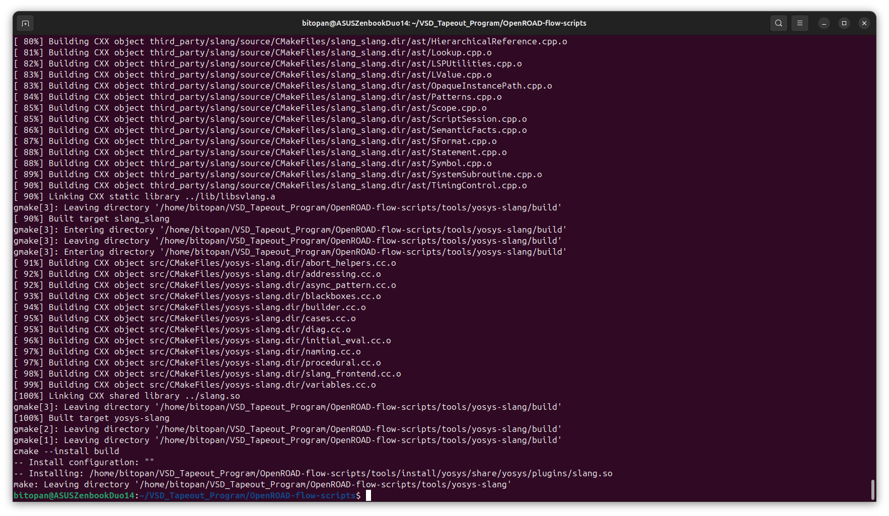
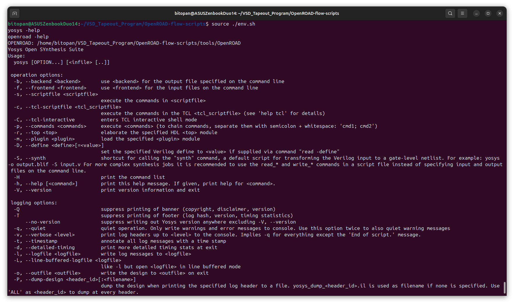
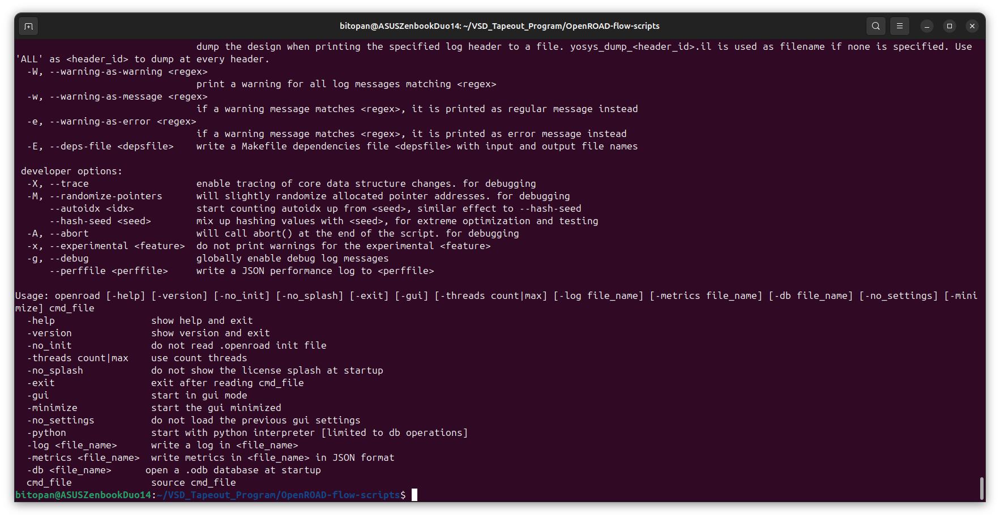
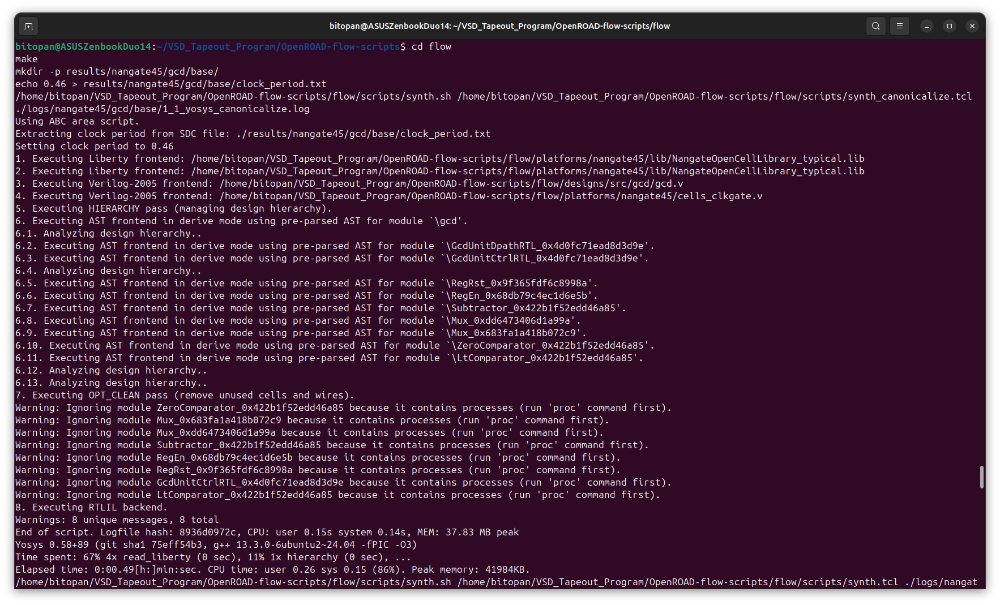
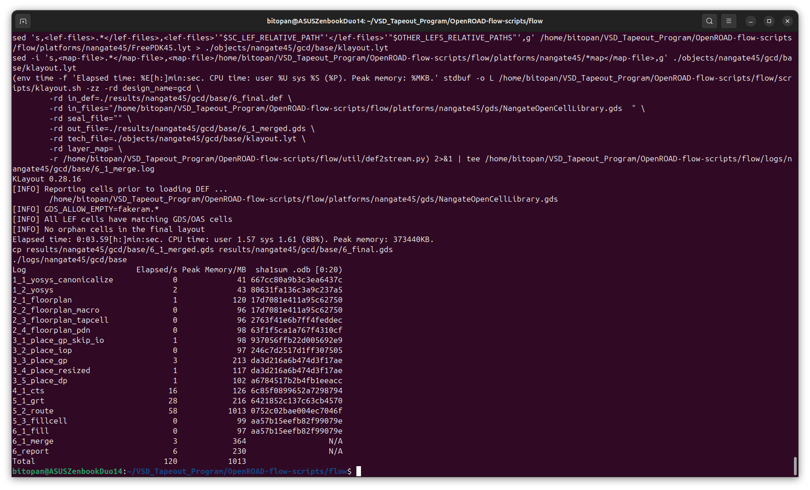
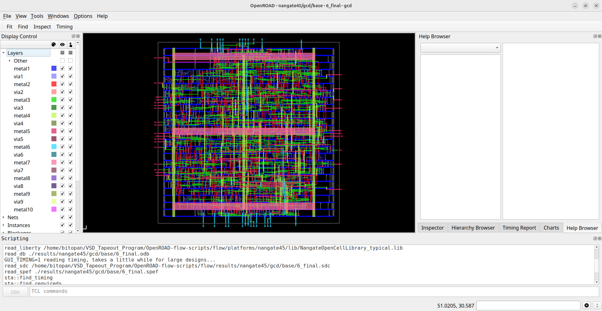
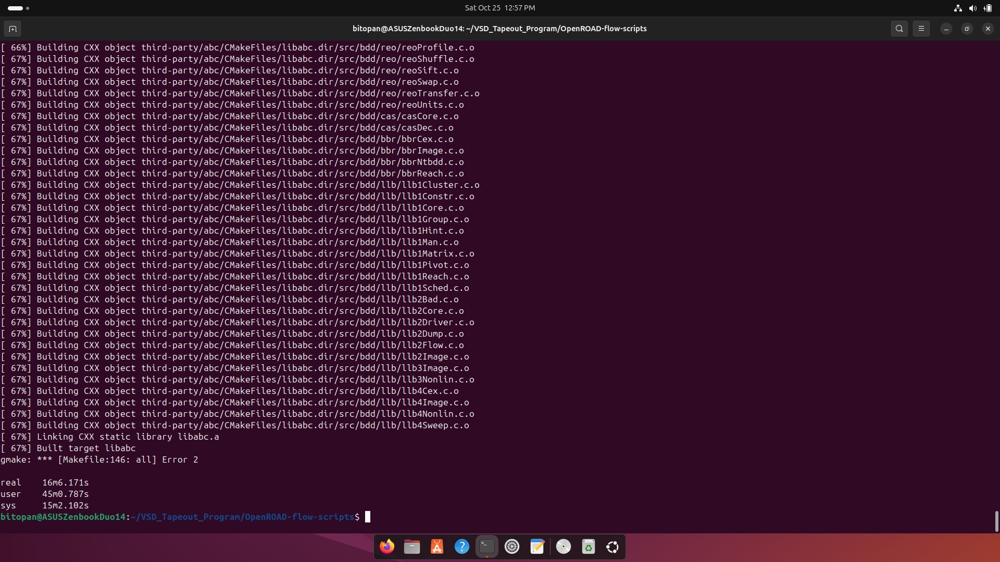
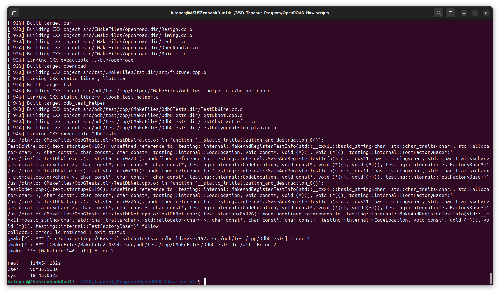

# Week 5: OpenROAD Flow Setup and Floorplan + Placement 
 
The focus of this week is to step into the physical design phase of the VSDBabySoC and understand how a synthesized netlist is transformed into a real, manufacturable layout. We begin by exploring the fundamentals of floorplanning—defining the chip’s physical boundaries, setting core utilization, choosing aspect ratios, and planning macro and I/O placement. Next, we study placement, where standard cells are arranged to optimize timing, wirelength, and congestion. This week also introduces the OpenROAD Flow Scripts (ORFS), covering their structure, key tools, and the process of setting up and running the flow for floorplanning and placement. Through installation, debugging, and hands-on execution of the flow, Week 5 establishes the foundation for routing, timing closure, and full RTL-to-GDS implementation in the upcoming stages. 

---

## 📜 Table of Contents
[📋 Prerequisites](#-prerequisites) <br>
[1. What is Physical Design?](#1-what-is-physical-design)<br>
[2. Introduction to OpenROAD Flow Scripts (ORFS)](#2-introduction-to-openroad-flow-scripts-orfs)<br>
[3. Introduction to Floorplanning](#3-introduction-to-floorplanning)<br>
[4. Introduction to Placement](#4-introduction-to-placement)<br>
[5. Installation of OpenROAD](#5-installation-of-openroad)<br>
[6. ORFS Directory Structure](#6-orfs-directory-structure)<br>
[⚠️ Challenges](#%EF%B8%8F-challenges)<br>
[🏁 Final Remarks](#-final-remarks)

---

## 📋 Prerequisites
- Basic understanding of Linux commands.

---

## 1. What is Physical Design?
Physical Design is the stage in the VLSI design flow where a digital circuit’s logical representation (synthesized netlist) is transformed into a geometrical layout that can be fabricated on silicon. In other words, it is the process of mapping abstract logic gates and connections into actual physical locations on a chip, taking into account area, timing, and manufacturability constraints.<br>
While synthesis focuses on functionality—ensuring the circuit produces the correct outputs—physical design focuses on real-world implementation, ensuring that the circuit can actually be built and will perform reliably under electrical, timing, and physical constraints.<br>
The key goals of physical design include:
- **Placement:** Determining the exact positions of standard cells, macros, and I/O pins.
- **Routing:** Connecting all the placed components with wires while avoiding conflicts and minimizing delay.
- **Timing, Power, and Area Optimization:** Ensuring that the chip meets the target clock speed, power budget, and area constraints.
- **Design Rule Compliance:** Making sure the layout adheres to the fabrication process rules defined by the technology (PDK).

Physical design acts as the bridge between logical correctness and manufacturable implementation, and it is often considered one of the most critical and complex phases in VLSI design.<br><br>
*Think of it as turning a blueprint (logic diagram) into a real, tangible building (chip layout) where every room (cell) has its place, corridors (wires) connect rooms efficiently, and the entire structure follows the rules of engineering and safety (process design rules).*

---

## 2. Introduction to OpenROAD Flow Scripts (ORFS)
OpenROAD Flow Scripts (ORFS) are a powerful open-source automation framework for performing the entire RTL-to-GDSII flow in VLSI design. Essentially, ORFS allows designers to take a synthesized netlist and progressively transform it into a physical layout ready for fabrication, while providing tools to check timing, area, and design rules at every stage.<br>
The primary goal of ORFS is to automate the otherwise complex, multi-tool physical design process, making it easier to experiment, debug, and optimize digital designs without relying on proprietary software.<br>

### <ins>1. Key Tools Integrated in ORFS</ins>
ORFS uses a combination of specialized open-source tools for different stages of the flow:
| Stage                     | Tool                        | Purpose                                                                                                                        |
| ------------------------- | --------------------------- | ------------------------------------------------------------------------------------------------------------------------------ |
| Synthesis                 | **Yosys**                   | Converts RTL into a gate-level netlist while optimizing logic for area and speed. You have worked with this in previous weeks. |
| Timing Analysis           | **OpenSTA**                 | Analyzes the timing of the synthesized netlist and verifies that it meets clock constraints.                                   |
| Placement                 | **RePlAce**                 | Determines the physical locations of standard cells and macros to optimize timing, wirelength, and congestion.                 |
| Routing                   | **FastRoute / TritonRoute** | Connects all placed components with metal wires while obeying design rules and minimizing delay.                               |
| Visualization & Debugging | **OpenROAD GUI**            | Provides a graphical interface to inspect layouts, placement, and routing for debugging and optimization.                      |

### <ins>2. Why ORFS is Useful?</ins>
- **Automation & Reproducibility:** With a single command sequence, ORFS can execute multiple stages of the flow, generating logs, reports, and layout files.
- **Modularity:** Each stage of the flow is independent, which allows designers to pause after synthesis, floorplanning, placement, or routing. For Week 5, we will focus only on floorplanning and placement, analyzing each step before moving forward.
- **Open-Source Transparency:** Unlike commercial tools, ORFS lets you peek “under the hood” of each tool, understand algorithms, and customize scripts for experimentation.
- **Scalable to Real Designs:** While lightweight enough for small designs like VSDBabySoC, ORFS also supports complex industrial-scale designs, making it a great learning bridge.

### <ins>3. Connecting to Previous Weeks</ins>
Since we’ve worked with Iverilog, Yosys, OpenSTA, and Ngspice, ORFS is a natural next step:
- **Yosys** → generates the netlist you already verified.
- **OpenSTA** → lets you check timing after placement.
- Now, ORFS brings physicality into the picture: placing cells, defining chip boundaries, and preparing for routing.

*In essence, ORFS lets us move from logical correctness to spatial correctness, giving our designs a “body” on silicon that can be analyzed, visualized, and eventually fabricated.*

---

## 3. Introduction to Floorplanning
Floorplanning is the first and one of the most critical steps in physical design. It involves defining the physical boundaries and layout of the chip before placing individual standard cells. Think of it as creating a “real estate map” for your design, where you decide how the space will be used efficiently while meeting timing, power, and routing constraints.

### <ins>1. Purpose of Floorplanning</ins>
The main goals of floorplanning are to:
- **Define the chip area:** Decide the overall dimensions of the chip die.
- **Define the core area:** Specify the portion of the chip that contains standard cells and macros. The core is usually smaller than the die area to leave room for IOs, power rings, and routing.
- **Identify block placement regions:** Determine where large modules (macros) or IP blocks will be located, as well as where standard cells will be placed later.

### <ins>2. Key Aspects of Floorplanning</ins>
- **Core Utilization Factor**:
  * It is the ratio of the area occupied by standard cells to the total core area.
  * A lower utilization leaves room for routing and future expansion but may waste space.
  * A higher utilization increases density but can lead to routing congestion and timing issues.
  * Typical utilization is around 60–70% for initial floorplanning.
- **Aspect Ratio**:
  * It is the proportion of width to height of the core area.
  * A well-chosen aspect ratio reduces interconnect lengths and helps optimize timing.
  * For example, a long, narrow core may increase routing congestion, while a square-like core often balances wirelength.
- **IO Pin Placement**:
  * It defines the locations of input/output pins around the periphery of the chip.
  * Proper IO placement can reduce signal delays and simplify routing.
  * Designers often cluster pins by function (e.g., clocks, resets, high-speed signals) to optimize performance.
- **Power Planning (Conceptual)**:
  * Includes defining power and ground rails, rings, and stripes to ensure stable voltage distribution.
  * Even though detailed power routing comes later, conceptual planning ensures macros and cells can access power efficiently.
  * Helps avoid IR drop and reliability issues in later stages.
- **Macro Placement**:
  * Large pre-designed blocks (e.g., memory or custom IP) are placed first to minimize conflicts.
  * Careful macro placement can reduce congestion and improve timing for nearby standard cells.
- **Guiding Principles**:
  * Minimize interconnect length between critical modules.
  * Ensure enough whitespace for routing channels.
  * Consider timing-critical paths while allocating space for cells.

### <ins>3. Why Floorplanning Matters</ins>
- Acts as the foundation for placement and routing. Poor floorplanning can cause congestion, timing violations, and routing conflicts later, which are expensive to fix.
- Helps visualize the chip as a physical entity, not just a logical diagram.
- Balances area, performance, and power before committing to detailed placement.

*In simple terms, if the chip were a city, floorplanning decides the city boundaries, main roads, and block zones, ensuring that later, the houses (standard cells) and utilities (power, clocks) can be placed efficiently.*

---

## 4. Introduction to Placement
Placement is the stage in physical design where all standard cells are assigned specific positions within the core area defined during floorplanning. The primary objective of placement is to optimize the chip’s performance and manufacturability by considering timing, wirelength, congestion, and design constraints.

### <ins>1. Objective of Placement</ins>
- Assign physical coordinates to every standard cell.
- Respect the floorplan boundaries, power rails, and macro positions.
- Minimize critical path delays and overall interconnect length.
- Prepare a layout that is feasible for routing, ensuring no overlaps or congestion issues.

*Think of placement as arranging furniture in a room: everything must fit, be accessible, and leave enough space for movement (routing).*

### <ins>2. Stages of Placement</ins>
1. **Global Placement**:<br>
   * Cells are positioned approximately across the chip area.
   * Focuses on high-level optimization such as:
     * Minimizing total wirelength between connected cells.
     * Distributing cells to avoid congestion.
   * Does not resolve overlaps or illegal placements; it’s more like creating a “heatmap” of where cells should generally go.
2. **Detailed Placement**:<br>
   * Fine-tunes the positions from global placement.
   * Resolves cell overlaps and enforces exact placement legality.
   * Optimizes placement for:
     * Local wirelength
     * Timing-critical paths
     * Congestion hotspots
   * Ensures that all cells lie on legal rows and adhere to design rules.

### <ins>3. Key Optimization Metrics in Placement</ins>
1. **Wirelength Minimization**:
   * Shorter connections reduce signal delay and power consumption.
   * Especially important for critical nets that affect timing.
2. **Congestion Reduction**:
   * Ensures that routing channels have enough space for all wires.
   * Avoids regions where too many cells are packed together, which can create routing violations later.
3. **Timing Preservation**:
   * Placement affects the delay along critical paths.
   * Cells on timing-critical paths may need to be moved closer together to meet clock requirements.
4. **Other Considerations (Conceptual)**:
   * **Power distribution:** Cells should have access to power rails without creating IR drop issues.
   * **Macro proximity:** Standard cells may need to be positioned relative to macros for performance and routing efficiency.
   * **Symmetry and predictability:** Often used in analog or mixed-signal blocks, though less critical in purely digital designs.

### <ins>4. Why Placement Matters</ins>
- Even a perfectly floorplanned chip can fail to meet timing or routing constraints if placement is poor.
- Placement directly influences chip speed, power consumption, and routability.
- A good placement ensures the design is ready for routing without major violations, while a bad placement can cause iterations that take days or weeks to fix.

*In simple terms, if floorplanning is the city map, placement is arranging the buildings and houses so that streets (wires) are short, traffic flows smoothly (timing), and no building blocks another.*

---

## 5. Installation of OpenROAD

### <ins>1. Clone the OpenROAD Flow Repository</ins>
```
# Pull the entire OpenROAD flow repo along with all its submodules so the full toolchain arrives complete.
git clone --recursive https://github.com/The-OpenROAD-Project/OpenROAD-flow-scripts

# Enter the Project Directory
cd OpenROAD-flow-scripts
```

<div align="center">
  
</div>
<div align="center">
  
</div>

### <ins>2. Run the OpenROAD Setup Script</ins>
```
# Execute the automated setup script with admin rights to install all required dependencies and build the OpenROAD toolchain.
sudo ./setup.sh
```

### <ins>3. Build OpenROAD Locally</ins>
```
# Compile the OpenROAD binaries inside the project directory without installing them system-wide.
./build_openroad.sh --local
```

<div align="center">
  
</div>

### <ins>4. Verify Installation</ins>
```
# Activate the environment variables and paths needed for Yosys, OpenROAD, and other tools.
source ./env.sh

# Verify Yosys Installation
yosys -help

# Verify OpenROAD Installation
openroad -help
```

<div align="center">
  
</div>
<div align="center">
  
</div>

### <ins>5. Build the Default Flow</ins>
```
# Switch into the flow folder where the OpenROAD automation scripts and Makefiles live.
cd flow

# Launches the full default OpenROAD flow using the provided Makefile.
make
```

<div align="center">
  
</div>
<div align="center">
  
</div>

### <ins>6. Launch the Final Layout in GUI Mode</ins>
```
# Open the final routed design in the OpenROAD GUI so you can visually inspect the layout, placement, routing, and DRC status.
make gui_final
```
<div align="center">
  
</div>

---

## 6. ORFS Directory Structure
```
OpenROAD-flow-scripts
├── bazel                     -> Bazel build configuration files for OpenROAD components
├── build_openroad.log        -> Log output from the OpenROAD build process
├── build_openroad.sh         -> Script to build OpenROAD binaries (local/system-wide)
├── dependencies              -> Metadata and helper scripts for dependency management
├── dev_env.sh                -> Developer-centric environment setup script
├── Dockerfile                -> Docker setup to containerize the entire flow environment
├── docker                    -> Docker helper scripts, images, and CI-related configurations
├── docs                      -> Official documentation for the flow and tool usage
├── env.sh                    -> Environment file that configures paths for tools like Yosys, OpenROAD, etc.
├── etc                       -> Dependency installer scripts, utility configs, and support files
├── flake.nix                 -> Nix package specification for reproducible builds
├── flake.lock                -> Lockfile ensuring deterministic Nix environment versions
├── flow                      -> Main RTL-to-GDS flow automation directory
│    ├── BUILD.bazel          -> Bazel build rules for the entire flow
│    ├── designs              -> Example SoC and design folders for running RTL-to-GDS flows
│    ├── logs                 -> Log files generated during each flow stage
│    ├── Makefile             -> The automation engine that drives synthesis, PnR, routing, signoff, etc.
│    ├── objects              -> Intermediate build artifacts generated during flow execution
│    ├── platforms            -> Process design kits (PDKs), tech LEFs, GDS, Liberty files, and node-specific data
│    ├── reports              -> Reports generated by synthesis, floorplan, placement, routing, STA, etc.
│    ├── results              -> Final outputs including DEF, GDS, SPEF, netlists, and extracted data
│    ├── scripts              -> TCL and shell scripts that implement each step of the flow
│    ├── test                 -> Test designs and flow validation utilities
│    ├── tutorials            -> Learning resources and guided examples for new users
│    └── util                 -> Helper utilities used across multiple flow stages
├── jenkins                   -> CI regression tests and build verification scripts
├── LICENSE_BUILD_RUN_SCRIPTS -> License information for build/run utilities
├── MODULE.bazel              -> Bazel module configuration
├── MODULE.bazel.lock         -> Lockfile for Bazel module dependencies
├── README.md                 -> Top-level documentation and intro to ORFS
├── setup.sh                  -> Interactive setup script for installing tools and dependencies
├── tclint.toml               -> TCL linter configuration for code quality checks
├── tools                     -> All required EDA tools packaged for running the flow
├── WORKSPACE.bazel           -> Root Bazel workspace definition
└── yamlfix.toml              -> YAML linter configuration for maintaining consistent formatting
```

---

## ⚠️ Challenges
### <ins>1. OpenROAD Build Failure at 67–69% Completion</ins>

- **Problem:** While executing the command `./build_openroad.sh --local` during the OpenROAD installation, the build process consistently failed at around 67–69% progress. The compilation terminated with a build-failure message, preventing the installation from completing.
  <div align="center">
    
  </div>

- **Causes:** Through detailed debugging and log analysis, the issue was traced to a lack of available disk space in the virtual machine. The VM had been allocated only 50 GB, most of which was already consumed by earlier tool installations and extracted dependencies. As the build process required additional space for intermediate binaries, caches, and object files, it repeatedly failed at the same stage.
- **Solution:** The problem was resolved by increasing the VM’s disk capacity from 50 GB to 75 GB. After expanding the storage and re-running the build script, the installation proceeded the 67-69% mark successfully, confirming that insufficient disk space was the root cause.

### <ins>2. Build Failure at 94% During Final Compilation Stage</ins>

- **Problem:** Near the end of the installation, the OpenROAD build process failed again—this time at around 94% completion. The error logs did not provide an immediately clear explanation, and the build consistently terminated during the final compilation and test-linking stage. Even after retrying, the process failed at the same point.
  <div align="center">
    
  </div>

- **Causes:** Although the error message itself was not fully conclusive, the failure pattern suggested issues related to resource contention during the final linking and test-generation phase. At this stage, OpenROAD typically compiles a large set of test binaries and performs heavy linking operations, which can trigger problems when:
  * Multiple threads compete for limited CPU, RAM, or I/O bandwidth.
  * Test suites attempt to build components that require additional libraries or system configurations not present in minimal setups.
  * The VM environment lacks the overhead needed for parallelized test builds.
  * Running tests consumes resources that slow or block the primary build process.
  
  In short, the combination of parallel builds + enabled tests can overload lightweight or constrained environments such as VMs.
- **Solution:** After consultations with peers, the build was re-attempted using:
  ```
  ./build_openroad.sh --local --threads 1 --openroad-args "-DENABLE_TESTS=OFF"
  ```

  This approach:
  * Disables the test suite, avoiding the resource-heavy final compilation of test binaries.
  * Limits the build to a single thread, reducing CPU and memory contention during linking.
  * Simplifies the build process, making it more VM-friendly.
  
  With these adjustments, the installation completed successfully without further failures.

---

## 🏁 Final Remarks

Week 5 marked the transition from logical design to its physical realization. By exploring floorplanning and placement, and setting up the OpenROAD Flow Scripts, this week established the groundwork for turning a synthesized netlist into an actual chip layout. Key ideas such as core sizing, aspect ratio, utilization, and placement optimization highlighted how early physical decisions shape timing, congestion, and overall layout quality.

Despite a few installation challenges, resolving them strengthened debugging skills and ensured a stable environment for the full PnR flow. With ORFS successfully configured, the design is now ready to move into routing, timing closure, and deeper physical verification in the coming weeks.

>[!IMPORTANT]
> For easy navigation to all the weeks of the program, please visit the [Master Repository](https://github.com/BitopanBaishya/VSD-Tapeout-Program-2025.git).
